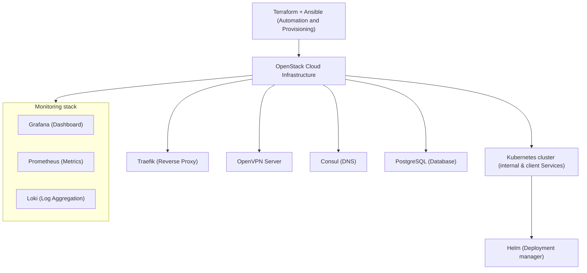

## Diagram Explanation

### Infrastructure Provisioning:

- Terraform + Ansible: These tools provision and automate the creation of all resources on OpenStack infra.

- OpenStack Cloud Infrastructure: Serves as the underlying platform where both non-Kubernetes services and the Kubernetes cluster are deployed.

### Non-Kubernetes Services:
These components are provisioned directly on OpenStack via Terraform + Ansible:

- Traefik (Reverse Proxy)

- OpenVPN Server

- Consul (DNS)

- Monitoring Stack (Grafana, Prometheus, Loki)

- PostgreSQL (Database)

### Kubernetes Environment:
Internal services and client applications are deployed within:

- Kubernetes Cluster (Internal & Client Services)

- Helm (Deployment Manager): Used for managing application deployments within the Kubernetes cluster.
