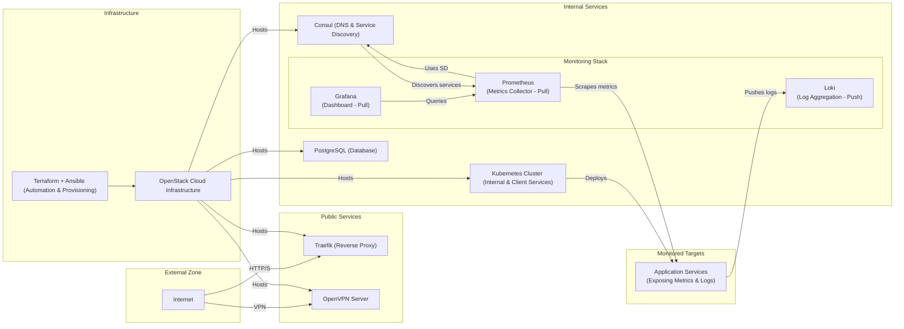

## Diagram Explanation

### External Zone:

- Internet represents the external access point where client requests originate.

### Public Services Zone:

- Traefik (Reverse Proxy) manages external HTTP/S traffic routing.

- OpenVPN Server handles secure VPN connections.

### Internal Services Zone:

- Kubernetes Cluster (Internal & Client Services) hosts internal and client-deployed applications.

- Consul (DNS) provides internal DNS and service discovery.

- PostgreSQL (Database) is used by the internal services.

- Monitoring Stack is detailed into three components: Grafana (dashboards), Prometheus (metrics), and Loki (log aggregation).

### Infrastructure Provisioning:

- Terraform + Ansible automate the provisioning of the infrastructure.

- OpenStack Cloud Infrastructure hosts all the resources, including the public services and the Kubernetes cluster.

### Connectivity:

- External traffic flows from the Internet to Traefik (and via VPN to the OpenVPN Server), which then routes requests to the Kubernetes cluster and other services.

- The infrastructure components provisioned via Terraform + Ansible manage all resources on the OpenStack platform.
