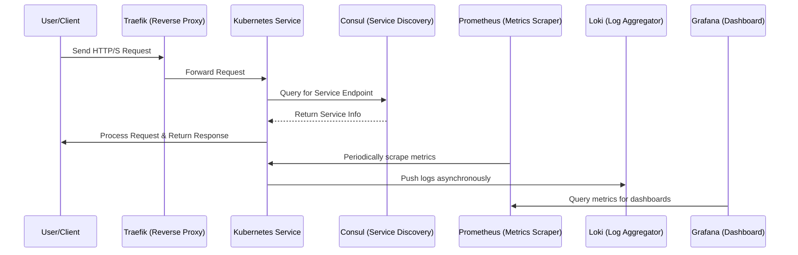

## Client Request Flow:

- User/Client sends an HTTP/S request that first reaches Traefik, which acts as the reverse proxy.

- Traefik forwards the request to a service running inside the Kubernetes Cluster.

- The Kubernetes service then queries Consul to perform service discovery and get the appropriate service endpoint.

- Consul returns the necessary service information.

- The service in Kubernetes processes the request and sends back a response directly to the User/Client.

## Monitoring Interactions:

- Prometheus is configured to periodically scrape metrics from the services hosted in Kubernetes.

- The Kubernetes service pushes logs asynchronously to Loki for log aggregation.

- Grafana queries Prometheus to visualize the collected metrics in dashboard form.
